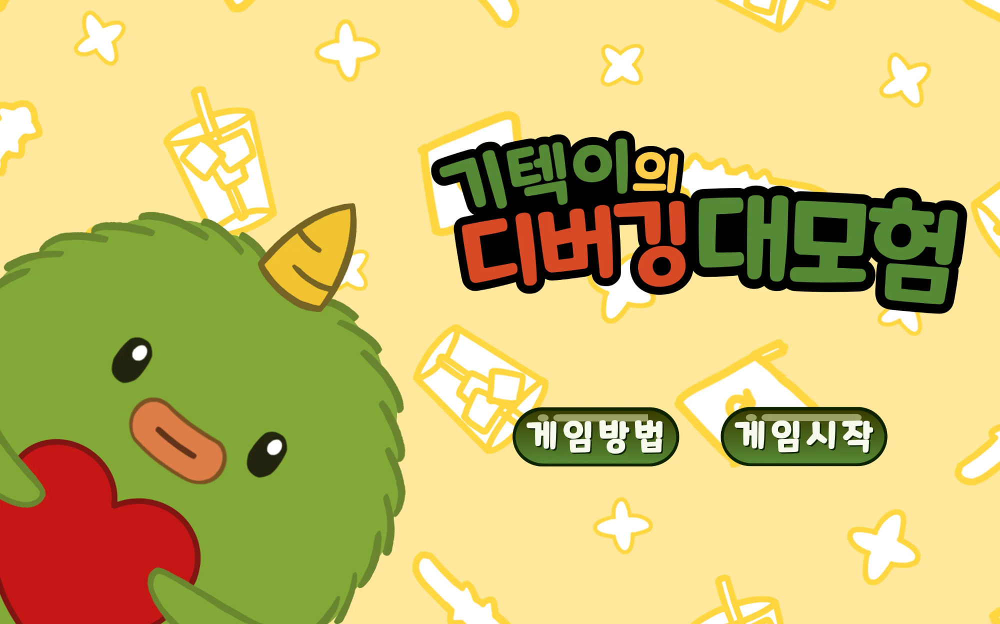
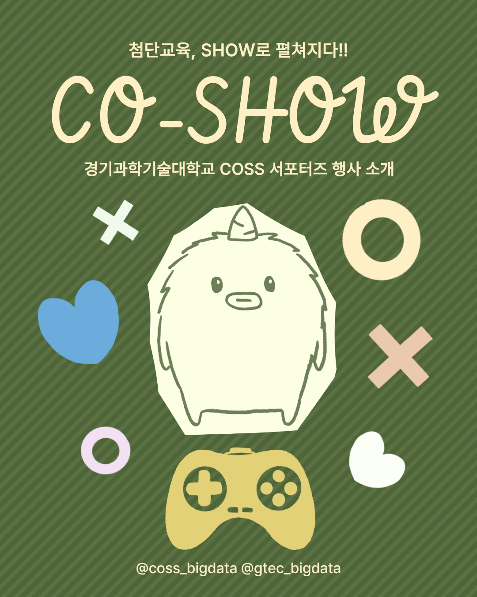
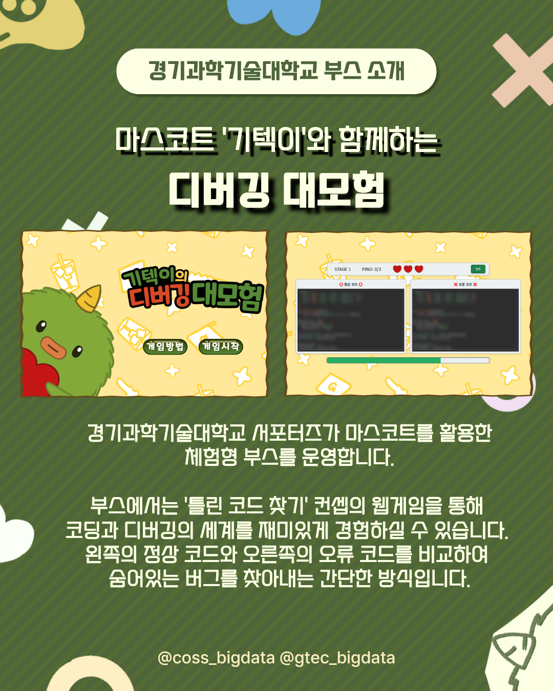
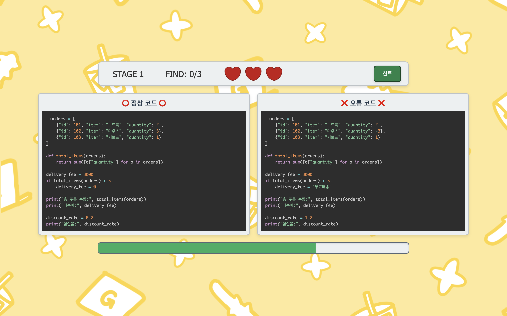
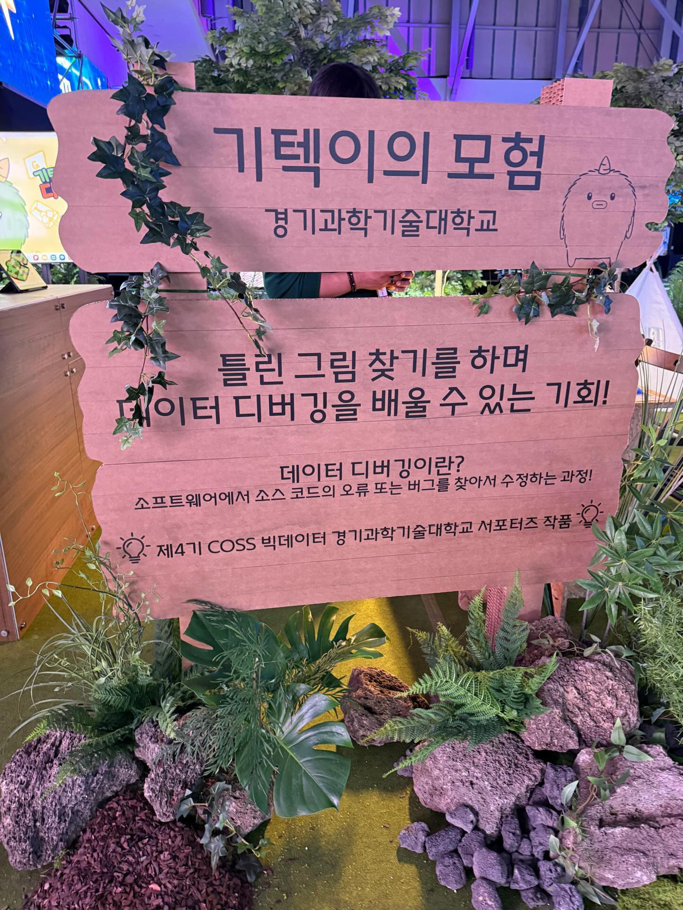
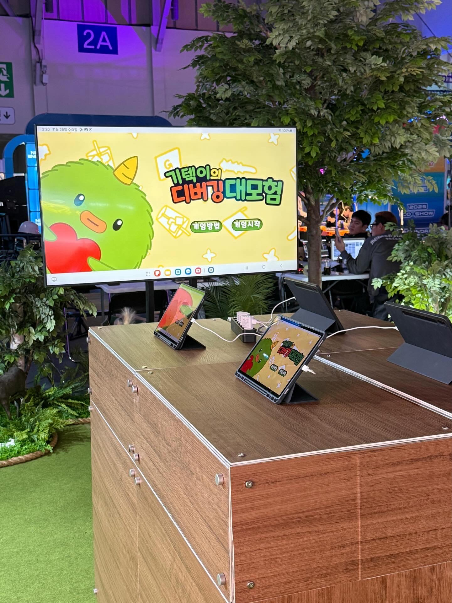
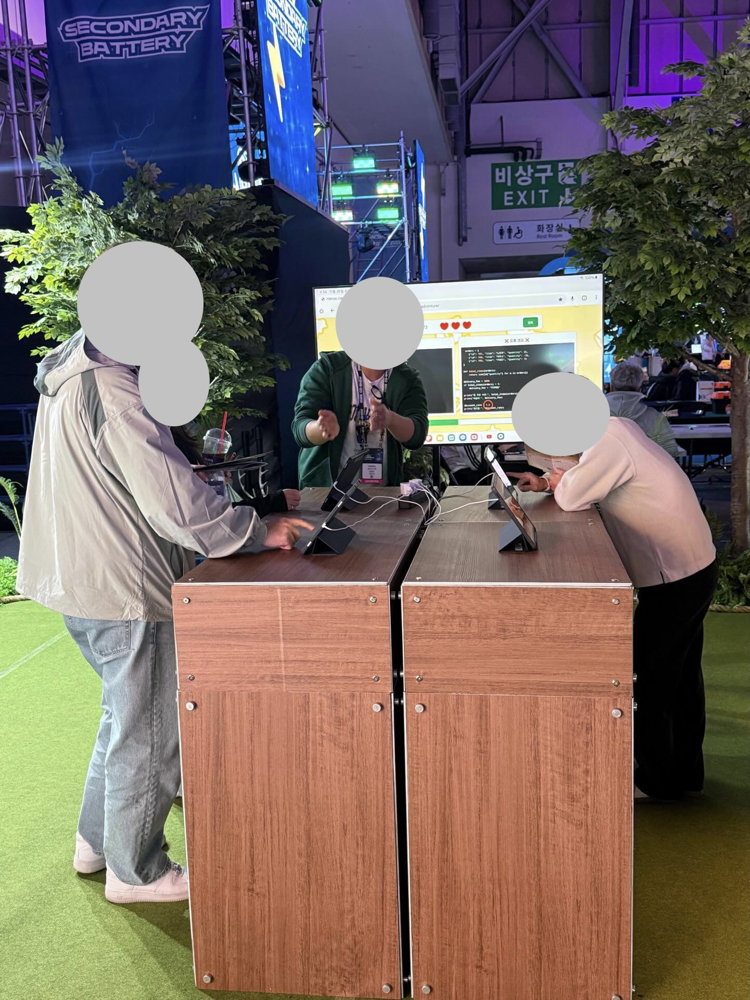
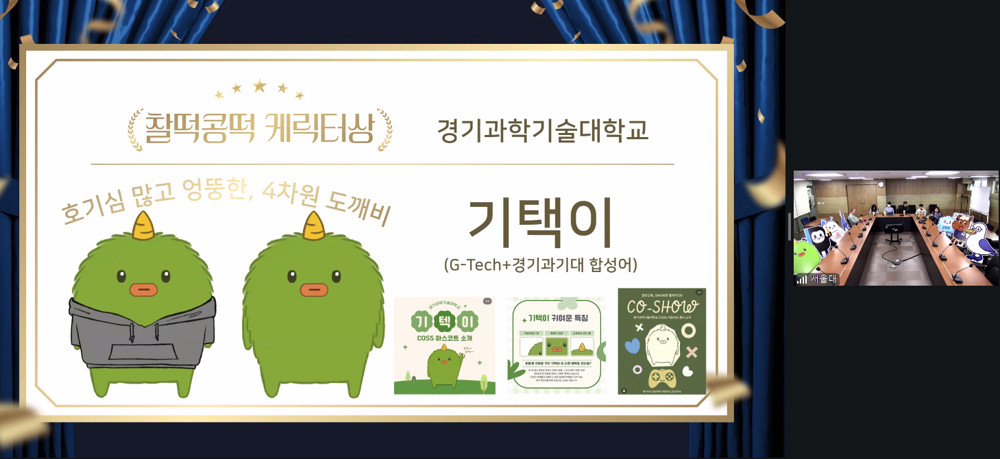

# 🧑‍💻 기텍이의 디버깅 대모험

<p align="center">

</p>

<p align="center">

### 경기과학기술대학교 COSS 서포터즈 체험형 웹게임 프로젝트

**Python 코드 속 오류를 찾아 디버깅을 배우는 인터랙티브 웹게임**

</p>

---

# 📖 프로젝트 소개

**기텍이의 디버깅 대모험**은 경기과학기술대학교 COSS 서포터즈 홍보 부스를 위해 기획부터 디자인, 개발, 운영까지 직접 제작한 **1인 개발 체험형 웹게임**입니다.

방문객들이 단순히 학교를 둘러보는 것이 아니라 직접 참여하며 프로그래밍과 디버깅의 개념을 쉽고 재미있게 이해할 수 있도록 제작하였습니다.

기존의 '틀린 그림 찾기' 방식을 응용하여 실제 Python 코드를 비교하는 방식으로 구성하였으며, 부산 **CO-SHOW** 행사에서 실제 운영되었습니다.

---

# 🚀 Project Journey


<table width="100%">
<tr>

<td align="center" width="50%">
<br><br>
<b>CO-SHOW Poster</b>
</td>

<td align="center" width="50%">
<br><br>
<b>Booth Promotion</b>
</td>

</tr>
</table>

본 프로젝트는 단순히 웹게임을 개발하는 것에서 끝나지 않았습니다.

- COSS 홍보 부스 기획
- 게임 컨셉 설계
- UI 디자인
- 웹게임 개발
- SNS 홍보 콘텐츠 제작
- 실제 행사 운영

까지 전 과정을 직접 수행하였습니다.

---

## 📝 Booth Planning

부스 기획안 전문은 아래 문서에서 확인할 수 있습니다.

📄 [Booth Planning Document](./docs/booth_plan.docx)

---

# 🎮 Game Screen

<table width="100%">
<tr>

<td align="center" width="50%">
<br><br>
<b>Main Screen</b>
</td>

<td align="center" width="50%">
<br><br>
<b>Game Play</b>
</td>

</tr>
</table>

메인 화면에서는 서포터즈 마스코트 **기텍이**를 활용하여 친근한 분위기를 조성하였으며,

게임에서는 실제 Python 코드를 비교하여 오류를 찾는 방식으로 디버깅을 자연스럽게 체험할 수 있도록 제작하였습니다.

---

# ✨ 주요 기능

## 🔍 Python 코드 기반 틀린 그림 찾기

- 실제 Python 코드를 비교하여 오류 찾기
- Prism.js를 활용한 Syntax Highlighting
- 실제 디버깅 환경과 유사한 UI 구성

---

## 🎲 랜덤 스테이지

- 총 5개의 Stage
- 단계별 난이도 상승
- 랜덤 문제 출제

---

## ❤️ 게임 시스템

- 제한 시간
- 하트(생명) 시스템
- 힌트 기능
- 배경음악 및 효과음

---

## 📱 터치스크린 최적화

행사 부스에서 운영하기 위해

- 태블릿
- 터치스크린

환경에 최적화하여 개발하였습니다.

---

# 🎪 CO-SHOW Booth

<table width="100%">
<tr>

<td align="center" width="33%">
<br><br>
<b>Booth Display</b>
</td>

<td align="center" width="33%">
<br><br>
<b>Booth Sign</b>
</td>

<td align="center" width="33%">
<br><br>
<b>Visitor Experience</b>
</td>

</tr>
</table>

개발한 게임은 부산 **CO-SHOW** 행사에서 경기과학기술대학교 홍보 부스로 실제 운영되었습니다.

방문객들은 태블릿을 이용하여 게임을 플레이하였으며,

단계별 클리어에 따라 굿즈를 제공하여 많은 참여를 이끌어냈습니다.

---

# 🏆 Achievement

<p align="center">



</p>

기텍이는 경기과학기술대학교 COSS 서포터즈를 위해 직접 기획한 마스코트입니다.

게임뿐 아니라

- SNS 홍보
- 행사 포스터
- 부스 디자인
- 굿즈

등 다양한 콘텐츠에 활용되었으며,

최종 **COSS 컨소시엄 세미나**에서 진행된 마스코트 발표에서 **최우수 평가**를 받았습니다.

---

# 🛠 Tech Stack

| Category | Skills |
|-----------|--------|
| Front-End | HTML5, CSS3, JavaScript |
| Data | JSON |
| Library | Prism.js |
| IDE | VS Code |

---

# 📁 Project Structure

```text
giteki-debug-adventure/
│
├── assets/
│   ├── images/
│   ├── problems/
│   ├── sounds/
│   └── problems.json
│
├── index.html
├── style.css
├── script.js
└── README.md
```

---

# 🌐 Demo

👉 https://PH-87.github.io/giteki-debug-adventure/

---

# 💡 What I Learned

이번 프로젝트를 통해 단순히 웹게임을 개발하는 것을 넘어,

- 사용자 경험을 고려한 UI 설계
- 행사 운영을 고려한 인터랙션 디자인
- 캐릭터 브랜딩
- 홍보 콘텐츠 제작
- 실제 사용자 피드백을 반영한 개선

까지 경험하며 **기획부터 개발, 운영까지 하나의 서비스를 완성하는 과정**을 경험할 수 있었습니다.
